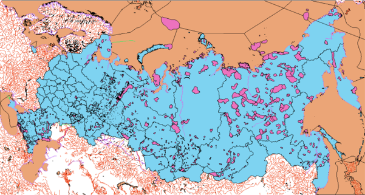
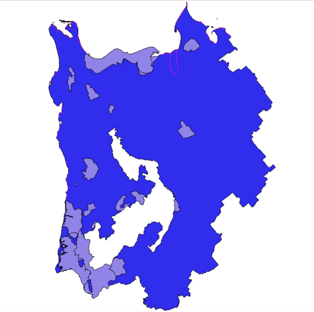
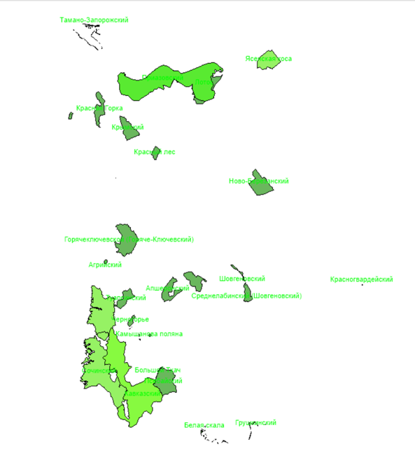
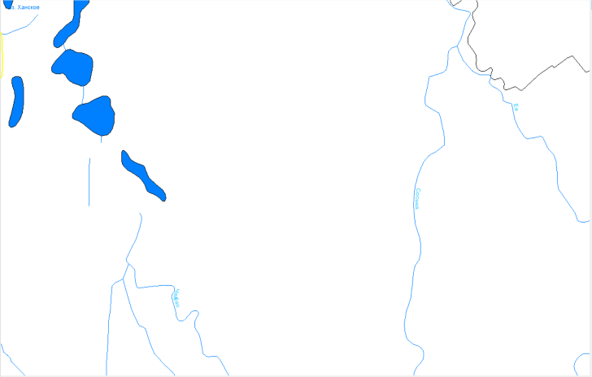
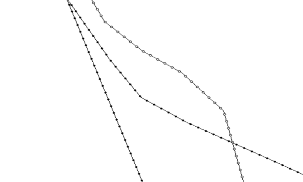
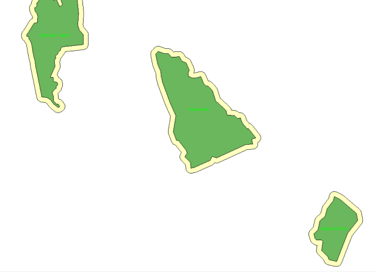
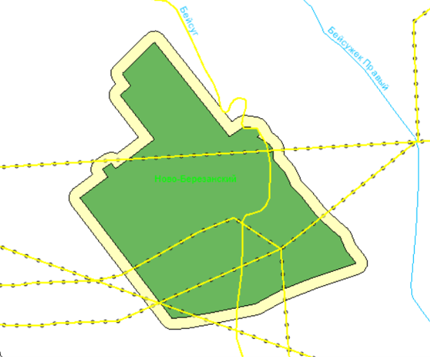
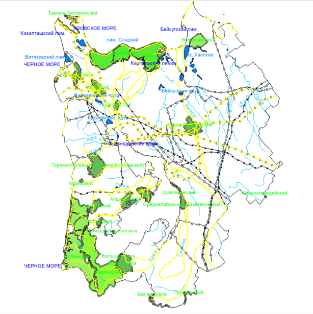

# ГИС-проект: анализ пересечения коммуникаций с буферными зонами заповедников Краснодарского края

Курсовой проект по дисциплине «Компьютерные технологии графического представления геолого-геофизической информации». Выполнен в системе ГИС INTEGRO.

## Задача

Определить, проходят ли линии коммуникаций (нефтепроводы, газопроводы) через буферные санитарные зоны особо охраняемых природных территорий (ООПТ) Краснодарского края.

## Инструменты

- **ГИС INTEGRO** — программно-технологический комплекс для интеграции и анализа геопространственных данных
- **SHP-файлы** — исходные слои (границы субъектов, коммуникации, гидрография, ООПТ)

## Методология

1. **Подготовка данных.** Загрузка слоёв `.shp`, выбор Краснодарского края через «Конструктор запросов» (поле `POA_SUBJ`), вырезание региона утилитой «Вырезать слои полигоном».
2. **Настройка стилей.** Группировка слоёв (Коммуникации, Топооснова), настройка отображения через уникальные значения и градиентные шкалы, добавление подписей объектов.
3. **Создание буферных зон.** Утилита «Создать буферные зоны» с радиусом 1000 м вокруг всех ООПТ.
4. **Пространственный анализ.** Утилита «Пространственный выбор» с методом «пересекают объекты» — определение коммуникаций, попадающих в буферные зоны.

## Результаты

- Выявлено, что **линии коммуникаций задевают территории большинства заповедников** Краснодарского края.
- Потенциальные риски: загрязнение при утечке нефти, пожары при выходе газа.

### Исходная карта

### Регион исследования

### Оформление заповедников и водоёмов

### Стили коммуникаций и буферные зоны

### Пересечения и итоговый проект

## Полная версия

Полный текст курсовой работы с описанием методологии: [`docs/krasnodar_gis_project.pdf`](docs/krasnodar_gis_project.pdf).

## Автор

Кобанов Сергей
